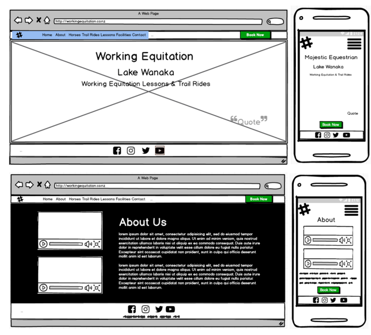
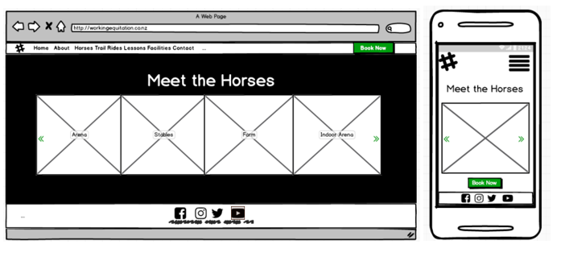
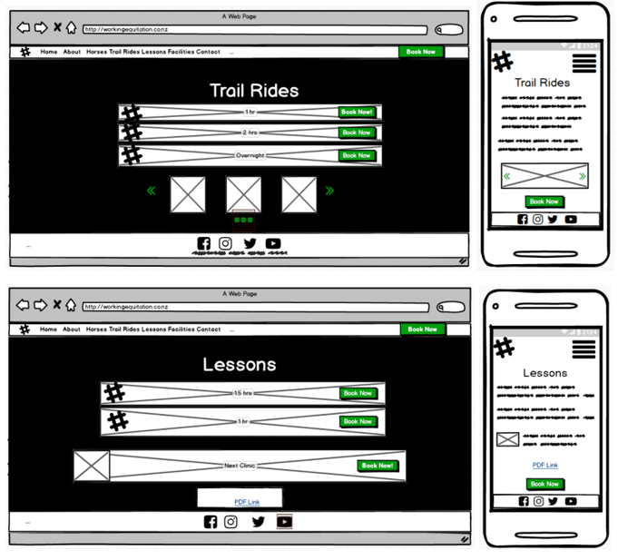
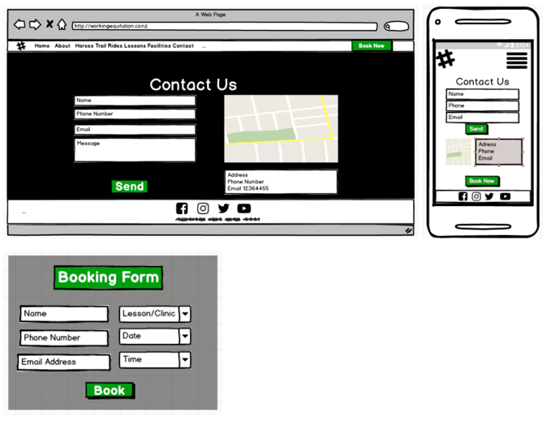

# First Milestone Project by Holly Horwood

(https://holly-horwood.github.io/first-milestone-project/)

---

#### Disclaimer: 
This website was designed for educational purposes only for the Code Institute.  All best endeavours have been made to ensure all content has been obtained legally and all good practice guide lines for web development have been followed.

---

#### Motivation/Purpose
A life-long love of horses and working with them lead me to create this website.  I have for the past couple of years had a strong interest in the relatively new sport of Working Equitation.  Being involved with horse and horse people means I have a lot of knowledge in this area and I know what is important to people from the equine world looking to learn through lessons as well as the general public who could be looking to enjoy a trail ride in their spare time.  I understand what they are wanting to find out when looking online for certain information, I believed I could create a user-friendly website that would help them to find the answers they were looking for.  I could also source a lot of free content myself through friends in my area I have ridden with over the years.

#### Technologies Used

-   Bootstrap with Javascript and jQuery
-   HTML5
-   CSS3

##### Other resources:

-   W3Schools
-   W3C Markup & CSS Validator
-   CSS Matic
-   Google Fonts

---

#### UX

*Research*
I have in the past spoken in length with an ex employer of mine about building a website for her Equestrian Centre.  I spoke with her again to see if anything had changed since then and what she would want from a website and how she thought it should look.  I also spoke to a couple of other friends in the industry to get their input on what should be included and what the eventual business outcome should be from having a website.

*Audience* 
This site was designed for the general public looking to trail ride and for all level of horse riders looking to take lessons in Working Equitation.

*Business Outcome*
An increase in profits due to brand awareness and ease of use for new and existing customers to find the business online and book lessons and trail rides.  It is also intended to showcase the property and the facilities available.

*Navigation*
It is essential that the site is easy to navigate on different sized devices and that it is obvious how to make a booking.  I decided to use relatively neutral colours for the content but with an eye-catching bright green to highlight key areas such as navigation, buttons and deals.  I chose the colour green as this is a calming colour and represents nature, so I thought it would be a good choice as potential customers would be looking to have a relaxing time in nature with horses.  I wanted a more traditional looking website with separate linked pages rather than the scroll down effect as I believe this is easier for people to navigate as it's not always obivious that ones needs to scroll on scroll down sites. 

*Features:*  
Each page has an identical header with a logo on the left and I have also included a call to action booking button on the right, so it is always obvious how to book.
Each page also has a footer with social links to Facebook, Instagram, twitter and YouTube as well as copyright information.
Each page has a centred white header.
All call to action/book now buttons link to a modal where the customer can fill out there details, select the service they would like and book a date and time.

*Home Page:*
This page has a simple header for the business and subheadings stating where the business is located and what it does.  There is also a quote on the bottom right from Winston Churchill.  I have a fixed background image of a small herd of horses running through the woods that is fixed to the background for all pages, however I have removed this for smaller devices as it looked to busy and have replaced it with a simple cleaner grey background.

*About:*
This page gives an overview of the business as well as the two key services offered.  There are also two Youtube videos alongside the overview text that show examples of the sport of Working Equitation.

*Horses:*
This page has a carousel with photos and the names of the horses that live on the farm.  I have used green again to highlight the carousel navigation on this page.

*Trail Rides:*
This page is before lessons as during my research we found that trekking is the main source of income before lessons.  It lists the different trail rides available and each one has its own call to action.  At the bottom of the page is another smaller carousel showing photos from past treks as inspiration for customers.

*Lessons:*
This page is very similar to the trail rides page although it doesn’t have a carousel, there is an image on the left of the clinic pricing which also highlights a special deal.

*Facilities:*
This page has another carousel with text explaining what each image is.

*Contact:*
This page has a contact form on the left requesting name, phone number and email as well as a textarea for any message the customer may want to add.  There is also a bright green send button.  On the right there is an interactive google map and below that the business contact phone number, address and email.

*Interaction Design:* 
The site has separate pages and was designed so there was no need to scroll down on larger devices.
There is a navigation bar at the top that displays all pages in a logical sequence of how somebody searching the site would likely want to view them and a book now button.
Every page that shows a service also has additional call to action buttons that when clicked on will launch a modal where the customer can book a service.
The Lessons page also has a link at the bottom of the page to a separate PDF that will open ina a separate tab when clicked on.  The Contact page has an interactive google map.

##### Balsamic Mockups

---

##### Testing:

This website was tested manually by myself as well as friends and family.  Each page was clicked through and each interactive part of each page was tested to ensure it was functional.

---

##### Deployment:

This website was developed in cloud9 and regularly pushed to the repository [Holly-Horwood/first-milestone-project] in Github.

---

##### Credits:

###### Content

All content was created by Holly Horwood

###### Media

*Videos* 
-   from YouTube on the about.html page

*Photos* 
-    arena.jpg and swimming.jpg supplied by Carol Armstrong of Waterfall Equestrian Centre
-	Swimming.jpg, creekcross.jpg and creek.jpg supplied by Tracy Mahy
-   Hightrail.jpg, lakeview.jpg and summit.jpg supplied by Samantha Goos
	Stables.jpg supplied by Zara-Lee MacDonald of High Country Stables
-   All other images were found through creative commons.

